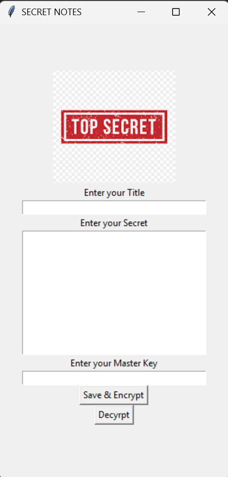

# Secret Notes Application

A simple desktop application for storing your encrypted notes securely.



## Features

- Save note titles and content
- Encrypt notes (using Fernet encryption)
- Decrypt notes using master key
- Simple and user-friendly interface

## Installation

1. Make sure Python is installed (Python 3.x)
2. Install required libraries:
```powershell
pip install cryptography pillow
```

## Usage

1. Start the program:
```powershell
python main.py
```

2. To add a note:
   - Enter a title
   - Write your secret note
   - Set a master key
   - Click "Save & Encrypt" button

3. To decrypt a note:
   - Enter the master key
   - Click "Decrypt" button

## Notes

- Encrypted notes are stored in `veri.txt`
- You can use different master keys for different notes
- The application will warn you if you leave any field empty

## Requirements

- Python 3.x
- cryptography
- tkinter (comes with Python)
- pillow (for image processing)
